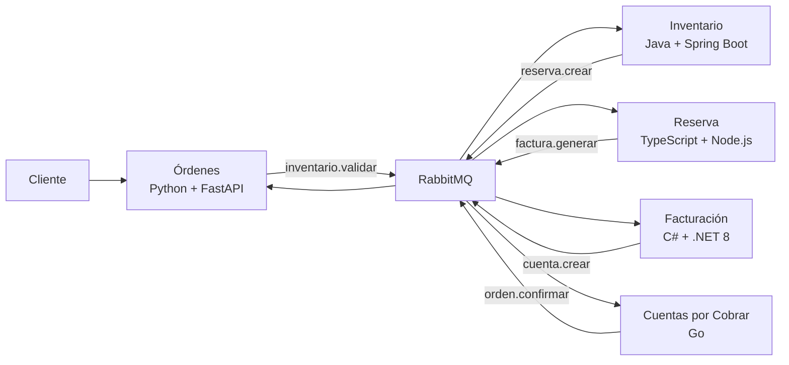

# Orquestación poliglota de órdenes con RabbitMQ

Este repositorio demuestra interoperabilidad real entre cinco runtimes: un pedido entra por Python y atraviesa Java, TypeScript, C# y Go mediante mensajes AMQP JSON UTF-8. No existen llamadas HTTP entre servicios ni acceso a bases ajenas; RabbitMQ conserva el trabajo cuando un consumidor está detenido.

## Matriz de servicios

| Servicio | Tecnología | Cola | Responsabilidad y base |
|---|---|---|---|
| Órdenes | Python 3.11, FastAPI, Pika | `cola_respuesta` | API, estado e historial; `db_ordenes` |
| Inventario | Java 21, Spring Boot, Spring AMQP | `cola_inventario` | stock y movimientos; `db_inventario` |
| Reserva | TypeScript, Node 22, amqplib | `cola_reserva` | reserva idempotente; `db_reserva` |
| Facturación | C#, .NET 8 Worker, RabbitMQ.Client | `cola_facturacion` | subtotal, IGV 18 % y factura; `db_facturacion` |
| Cuentas por cobrar | Go 1.22, amqp091-go | `cola_cxc` | cuenta y confirmación; `db_cxc` |



## Topología y contrato

El exchange directo es `fisi.ordenes.exchange`; su DLX es `fisi.ordenes.dlx`. Las seis colas oficiales son `cola_inventario`, `cola_reserva`, `cola_facturacion`, `cola_cxc`, `cola_respuesta` y `cola_errores`. Sus bindings están declarados en [definitions.json](infrastructure/rabbitmq/definitions.json). `reserva.liberar` es un binding adicional de compensación hacia Inventario.

Cada evento contiene `message_id`, `event_type`, versión 1, `correlation_id`, `causation_id`, `id_orden`, timestamp UTC, source, attempt y payload. Los esquemas y AsyncAPI están en [contracts](contracts). Cada consumidor rechaza propiedades desconocidas, usa ACK manual/prefetch 1 y registra `message_id` en la misma transacción local que su operación. Las publicaciones son persistentes y usan confirms.

## Ejecución desde cero

Requisitos: Docker Desktop con Compose v2 y puertos 5672, 15672 y 8000 libres.

```powershell
Copy-Item .env.example .env
docker compose up --build -d
docker compose ps
```

API: <http://localhost:8000>; Swagger: <http://localhost:8000/docs>; RabbitMQ: <http://localhost:15672> (`fisi` / valor de `RABBITMQ_PASSWORD`). En Windows también puede usarse `powershell -ExecutionPolicy Bypass -File scripts/stack.ps1 up`.

Comandos Make: `make up`, `make down`, `make rebuild`, `make seed`, `make test`, `make logs` y `make clean`. `clean` elimina los volúmenes del stack.

## Pruebas reproducibles

```powershell
.venv\Scripts\python.exe -m pip install -r tests\requirements.txt -r services\ordenes-python\requirements.txt
.venv\Scripts\python.exe -m pytest -q tests\contract services\ordenes-python\tests
python tests\integration\e2e.py
python tests\integration\idempotency.py
powershell -ExecutionPolicy Bypass -File tests\integration\resilience.ps1
python tests\integration\dlq.py
```

El E2E crea una orden válida y una sin stock. Para ver el trayecto de una orden: `powershell -ExecutionPolicy Bypass -File scripts/filter-logs.ps1 -CorrelationId <uuid>`. Para observar colas: `docker compose exec rabbitmq rabbitmqctl list_queues name messages consumers`.

## Resiliencia y errores

Errores de negocio producen `orden.error` y `RECHAZADA`. Errores técnicos se republican con `attempt+1` hasta `MAX_RETRIES`; después pasan como `error.tecnico` a la DLQ. Si Facturación agota reintentos, emite además `reserva.liberar`; Inventario devuelve stock una sola vez mediante un movimiento `LIBERACION`. Al detener Facturación, el mensaje permanece durable en `cola_facturacion` y continúa tras reiniciarla.

## Rollback

El original está preservado en la rama `backup-python-original` y como copia en `legacy/python-original`. Para inspeccionarlo sin perder cambios: `git worktree add ..\Rbbit-python backup-python-original`. No use `git reset --hard` sobre trabajo no guardado.

## Estado y problemas conocidos

El 20-07-2026 se construyeron las cinco imágenes y pasaron E2E, rechazo, duplicado, caída/reanudación y DLQ. PostgreSQL es un servidor compartido con cinco bases/usuarios aislados. El flujo emplea transacción local más publisher confirm, pero no un outbox distribuido; una caída en la estrecha ventana entre publish y commit puede producir un duplicado, absorbido por la idempotencia downstream. El hash del password de desarrollo RabbitMQ está incluido en `definitions.json`; si cambia `RABBITMQ_PASSWORD`, regenere ese hash o la importación declarativa conservará `fisi_dev`.
