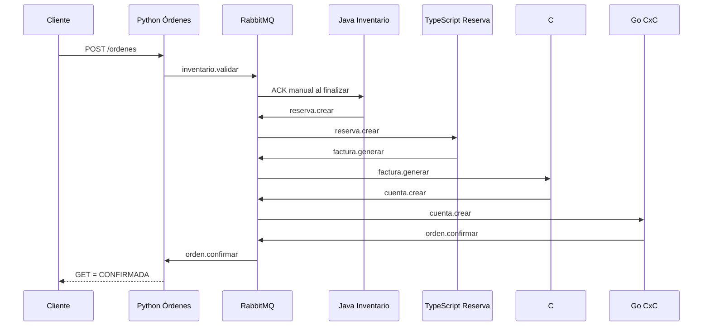
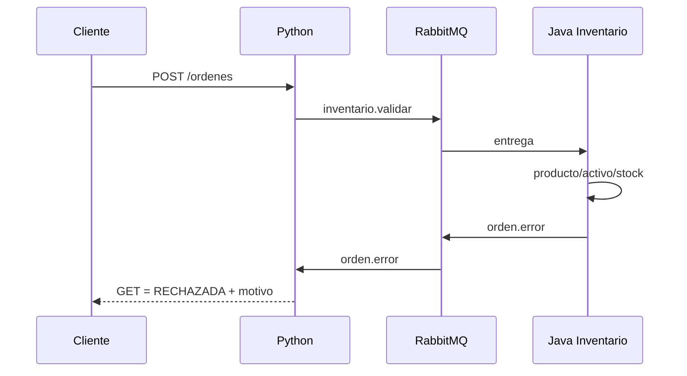

# Arquitectura

## Flujo exitoso

## Rechazo

Cada dominio crea sus tablas al arrancar en su propia base. No hay foreign keys ni consultas entre bases. Inventario es el único dueño del stock. La traza de estados viaja en el payload y Python la materializa al recibir el evento terminal.
